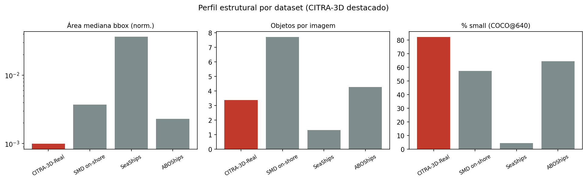
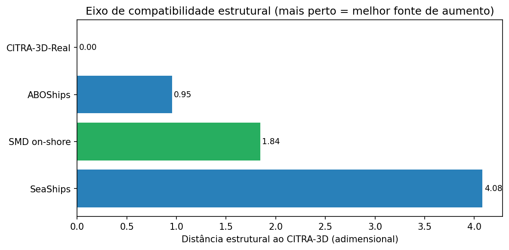

# Plano de Experimento — Aumento Cross-Domain do CITRA-3D-Real

### Compatibilidade estrutural como preditor de transferência: dado real estruturalmente-próximo (ABOShips, SMD on-shore) e composição sintética multi-fonte para detecção operacional de embarcações

| | |
|---|---|
| **Projeto** | CASNAV/DMarSup — Termo 66/2025 |
| **Documento** | Protocolo experimental (v1, rascunho para revisão) |
| **Data** | 26/06/2026 |
| **Responsável** | Daniela L. Freire (ICMC/USP) |
| **Supervisão** | Cmte. Leandro A. S. Moreira (LNCC) |
| **Dataset original (InaTechShips)** | Eduardo H. Teixeira (UNIFEI/INATEL) |
| **Status** | Aguardando autorização do supervisor para alocação de compute |

> **Nota de escopo.** Este documento é um *plano*, não um relatório de resultados. Ele define hipóteses, braços, splits, métricas e critérios de decisão **antes** da execução, de modo a (i) guiar a equipe e (ii) servir de base para a extensão de periódico do artigo *"Visual Similarity Is Not Enough"*. Nenhum número de resultado aqui é definitivo; os valores citados são os já estabelecidos no artigo atual e servem de referência.

---

## 1. Contexto e ponto de partida

O artigo atual estabelece três achados sobre o uso de imagens públicas de navios para detecção operacional no CITRA-3D-Real:

1. **Transferência negativa estrutural.** Pré-treino direto no InaTechShips (~28k imagens públicas, close-range) degrada o mAP50 em **−4,15 pp** (Arm A) frente ao baseline COCO (B2 = 0,8351 ± 0,0020), independentemente de curadoria por CLIP (Arm B, −4,06 pp). A causa é um gap **estrutural** — escala, densidade e contexto de captura — não semântico.

2. **Solução por composição sintética in-place + treino conjunto balanceado.** O braço A′joint atinge **0,8451 ± 0,0033** (+1,00 pp sobre B2), elevando o Recall de 0,783 → 0,805 (+2,2 pp; +2,8% relativo) sem perda de precisão.

3. **Ancoragem espacial é higiene de dados.** A ablação A′joint-rand mostra que a colocação exata dos crops não é o motor do ganho.

O probe zero-shot na **Singapore Maritime Dataset (SMD on-shore)** (Tabela IV do artigo: 914 imagens, 36 vídeos) confirma as duas direções num domínio independente: B2 = 0,5868 zero-shot; arms InaTech abaixo; arms sintéticos acima.

**Lacuna que este experimento ataca.** O artigo prova um *negativo* (similaridade visual via CLIP **não** prevê utilidade de transferência), mas não oferece um **preditor positivo** de quando uma fonte externa *vai* ajudar. Este experimento fornece o caso positivo que fecha o argumento e, simultaneamente, entrega uma receita operacional de aumento do CITRA-3D.

---

## 2. Diagnóstico crítico das fontes candidatas (registro para a equipe)

Três datasets foram inicialmente cogitados como "contexto similar ao CITRA-3D" (Roboflow Universe). A verificação mostrou que **os três são, na prática, a mesma base — a Singapore Maritime Dataset (SMD)** reembalada:

| Fonte (Roboflow) | Imagens | Evidência de ser SMD |
|---|---|---|
| `maritime-cumkb/singapore-maritime` | 6.350 | Nomes `MVI_1448_VIS_Haze`, `MVI_1530_NIR`; 9 classes SMD; VIS+NIR+Haze, on-board+on-shore |
| `connor/smd-val2` | 2.296 | Split de validação do SMD (classes `boat-buoy-other`) |
| `cyrls-workspace/vessels-ships-2` | 6.257 | Frame `MVI_0790_VIS_OB_frame385`; taxonomia SMD de 9 classes |

**Consequências que condicionam todo o desenho:**

- **Não há três fontes independentes.** Combiná-las replica o SMD, com sobreposição de frames entre os "splits" arbitrários do Roboflow (vazamento potencial).
- **Conflito com o held-out atual.** O SMD on-shore é o probe zero-shot já publicado. Treinar com qualquer um desses datasets **invalida a alegação de generalização** (Tabela IV) e o `smd-val2` pode ter overlap literal com os frames de teste.
- **Decisão de design forçada:** se o SMD passar a ser fonte de treino, é obrigatório (a) reconstruir a partir do SMD original com split disjunto por vídeo e (b) introduzir um **novo** held-out verdadeiramente independente para sustentar a generalização.

---

## 3. Pergunta de pesquisa e hipóteses

**Pergunta.** A *compatibilidade estrutural* entre fonte e domínio operacional prediz o sinal e a magnitude da transferência — e dado real estruturalmente-próximo pode aumentar o CITRA-3D sem reincorrer na transferência negativa observada com o InaTechShips?

**Hipóteses.** *(Atualizadas após o perfil estrutural do §6.1, que mediu ABOShips 0,95 < SMD 1,84 < SeaShips 4,08 — invertendo a aposta inicial no SMD como mais próximo.)*

- **H1 (preditor positivo).** Como o **ABOShips** é estruturalmente o mais próximo do CITRA-3D (d=0,95) — apesar de ser **câmera móvel** (waterbus), viewpoint diferente da câmera fixa costeira —, o pré-treino sequencial em ABOShips **não** reproduzirá o colapso de ~−4 pp do Arm A; espera-se resultado ~neutro ou positivo. O fato de o ABOShips ter cenário/viewpoint distintos torna o teste **mais forte**: se ajudar apesar disso, é a estrutura (escala/densidade), não a aparência do cenário, que governa a transferência.

- **H2 (ganho operacional por co-treino real).** Treino conjunto balanceado de CITRA-3D + ABOShips real (sem síntese) melhora a detecção operacional, com ganho concentrado em Recall (mais positivos reais). Replicar com SMD on-shore como segunda fonte próxima confirma o efeito e mantém coerência com o probe já publicado.

- **H3 (método source-agnostic).** A composição in-place com crops vindos do ABOShips (fonte mais próxima) preserva o ganho de A′joint. Comparar com crops de fonte **distante** (SeaShips/InaTechShips) testa diretamente se o realinhamento estrutural torna o método robusto à fonte.

- **H4 (curva preditora).** Ordenando as fontes **efetivamente treinadas** por distância estrutural medida — **ABOShips (0,95) → SMD on-shore (1,84) → InaTechShips (≫, Arm A)** — o Δ-transferência varia monotonicamente do ~neutro/positivo ao fortemente negativo, fornecendo um preditor acionável. A distância do SeaShips (4,08) contextualiza por que ele serve de held-out e não de fonte.

**Contribuição pretendida para o artigo futuro.** Converter o achado negativo ("CLIP não prevê") em um **preditor estrutural** de transferência, validado por um caso positivo (**ABOShips** — o mais compatível estruturalmente, ainda que "não pareça" o CITRA) que contrasta com o caso negativo já publicado (InaTechShips), mais a receita operacional de aumento do CITRA-3D.

---

## 4. Datasets e papéis

> **Papéis definidos empiricamente pelo perfil estrutural (§6.1, executado em 26/06/2026).** A medição **inverteu a hipótese a-priori**: o ABOShips, e não o SMD, é a fonte estruturalmente mais próxima do CITRA-3D. Os papéis abaixo refletem o ranking de distância medido (ABOShips 0,95 < SMD 1,84 < SeaShips 4,08).

| Dataset | Papel | Distância ao CITRA | Observações |
|---|---|---|---|
| **CITRA-3D-Real** | Alvo (treino + teste in-domain) | 0 (ref) | Splits congelados: 1.348/332/401. **Inalterados.** |
| **ABOShips** | **Fonte primária de aumento** (real + crops) | **0,954** (1º) | Câmera **móvel** (arquipélago finlandês), mas estruturalmente a mais alinhada (escala, densidade, %small). 1280×720. Excluir `seamark`/`miscellaneous`. |
| **SMD on-shore (VIS)** | **Fonte secundária de aumento** + coerência com o probe já publicado | 1,843 (2º) | Já em YOLO classe única (914 imgs). Afasta-se sobretudo por ser **denso demais** (7,71 obj/img). Split **disjunto por vídeo** antes de treinar. |
| **SeaShips** | **Held-out independente** (probe zero-shot de generalização) | 4,082 (3º) | **Não-SMD**, reservado: jamais em treino/val/tuning. VOC limpo (~7k, sem augmentation). Navios grandes e esparsos → testa um **regime estrutural distinto**. |
| **InaTechShips** | Âncora "longe" da curva H4 | ≫ (já medido) | Arm A, −4,15. Extremo do eixo de distância. |

A leitura científica é favorável: a fonte que *menos parece* o CITRA num olhar de cenário (plataforma móvel, outro continente, outro propósito) é a **estruturalmente mais compatível** — reforça a tese "estrutura > aparência" com um caso positivo novo. Curva de distância para H4: **ABOShips (0,95) → SMD (1,84) → SeaShips (4,08) → InaTechShips (≫)**.

**Trade-off registrado (held-out SeaShips).** A 4,08, o SeaShips é quase tão distante quanto o InaTechShips; um modelo treinado em embarcações pequenas/densas pode ter mAP zero-shot baixo e pouco discriminativo nele. Mitigações: (i) reportar também AP/AR por tamanho no held-out; (ii) se a separação entre braços for nula, considerar como held-out um *split disjunto por vídeo* de uma fonte costeira não usada no treino, ou um quarto dataset costeiro (MID/ABOShips-PLUS). Decisão final após o primeiro zero-shot.

---

## 5. Pré-processamento e protocolo de preparação de dados

### 5.1 Taxonomia
Colapsar todas as anotações para a classe única `vessel`, **idêntico** ao que foi feito no probe SMD do artigo. Decisão sobre `Buoy`/`Kayak`/`Other` deve replicar exatamente o mapeamento já usado (documentar a regra final para reprodutibilidade). Excluir classes não-embarcação (`Flying bird-plane`).

### 5.2 Filtragem das fontes externas

**ABOShips (fonte primária):** excluir classes não-embarcação (`seamark`, `miscellaneous`); manter os 9 tipos de embarcação colapsados em `vessel`. Resolução fixa 1280×720. Split disjunto por **sequência/origem de captura** (não embaralhar frames vizinhos do mesmo trajeto do waterbus). Registrar o confound de viewpoint (câmera móvel).

**SMD on-shore (fonte secundária):**
- Manter **apenas on-shore VIS**. Descartar on-board (`_OB_`), NIR e Haze do conjunto de treino principal (o `smd_clean` atual inclui frames `_Haze_` — filtrar para bater com o probe publicado).
- Split disjunto por vídeo (`MVI_id`), como no §5.3.

### 5.3 Splits — regra inegociável
- **Split disjunto por vídeo.** O SMD é vídeo; frames do mesmo vídeo são quase-duplicados. Dividir por `MVI_id`, p.ex. ~24 vídeos → treino / ~12 vídeos → teste, **sem** vídeo compartilhado. **Não** usar os splits pré-fabricados do Roboflow.
- **Subamostragem temporal** para reduzir redundância (mesmo critério do probe atual).
- **Held-out = SeaShips (decidido no §6.1):** reservado integralmente para avaliação zero-shot; jamais usado em treino, validação, tuning ou seleção de modelo. Foi o **mais distante entre as fontes não-SMD** (4,08), garantindo independência. Atenção ao trade-off do §4 (pode ser distante demais para discriminar braços) — reavaliar após o primeiro zero-shot.
- **Fontes de aumento = ABOShips (primária) + SMD on-shore (secundária):** ABOShips por ser a mais próxima (0,95); SMD por proximidade (1,84) e coerência com o probe publicado. Ambas exigem split disjunto por vídeo/sequência antes do treino.

### 5.4 Anti-vazamento
Congelar todos os splits **antes** de qualquer geração sintética. Nenhuma imagem/anotação/fundo de teste (CITRA-3D, SMD-test, held-out) pode entrar em qualquer etapa de treino, validação ou geração de crops.

### 5.5 Implementação — decisões e adaptações (registro para reprodutibilidade)

Adaptações feitas durante a implementação, com justificativa. As duas primeiras são adaptações metodológicas assumidas no texto; a ablação (50 vs. 20 px) fica como *future work*.

- **Dimensão mínima de crop reduzida de 50 → 20 px.** 66,3% das caixas do ABOShips têm lado menor < 50 px (mediana 34 px); o filtro original (calibrado para os navios grandes do InaTechShips) descartaria dois terços dos crops. A redução é coerente com a menor escala da fonte e com o domínio-alvo (CITRA, embarcações minúsculas). Efeito: *yield* de extração 25,8% → 62,8% (18.420 crops).
- **Filtro de opacidade pós-segmentação** (passo novo). Remove crops cuja máscara SAM cobre < 20% da bbox ou com lado < 24 px — ruído mais frequente em embarcações pequenas. Removeu 13,0% (2.389 de 18.405), restando **16.016 crops limpos**.
- **Composição fiel ao artigo:** 13 variações × CITRA(train+val) = 21.840 sintéticas; joint balanceado 17.524 real (×13) + 17.524 sintético = 35.048 imgs/época (50/50).
- **Provisão de labels:** os labels operacionais de classe única do CITRA-3D residem em `labels_single_class/` (o diretório `labels/` contém rótulos multi-classe legados); o pipeline usa exclusivamente os de classe única. Detalhes de formato do ABOShips (imagens PNG; CSV com dimensões de bbox, não da imagem; exclusão de `seamark`/`miscellaneous`) documentados no repositório.

---

## 6. Passo zero — perfil estrutural (sem treinar)

Antes de alocar GPU, computar o **perfil estrutural** de cada fonte e do candidato a held-out, no mesmo formato da Tabela I do artigo:

- mediana da **área normalizada** da bbox (% da imagem);
- **objetos por imagem** (média);
- **% de objetos "small"** (convenção COCO, < 32×32 px a 640).

Plotar todas as fontes no **eixo de compatibilidade estrutural** (distância ao CITRA-3D). Saídas:
1. Tabela comparativa (CITRA-3D vs. SMD on-shore vs. SMD on-board vs. InaTechShips vs. held-out).
2. Gráfico do eixo de distância — **primeira figura** do experimento e gate de decisão: a fonte de aumento deve estar demonstravelmente mais próxima do CITRA-3D que o InaTechShips, senão H1 perde a premissa (confirmado no §6.1: ABOShips e SMD bem mais próximos).

(Opcional) score escalar de distância $d(\text{fonte}, \text{CITRA})$ combinando os três eixos (p.ex. razão log da área mediana, razão de densidade, diferença de %small). Apresentar como perfil de 3 eixos + score auxiliar, sem sobre-interpretar com $n$ pequeno de fontes.

### 6.1 Resultados (executado em 26/06/2026)

Perfil medido sobre os datasets completos, classe única `vessel` (ABOShips com `seamark`/`miscellaneous` excluídos; ABOShips a 1280×720; %small = COCO@640):

| Fonte | imgs | boxes | área mediana (norm.) | obj/img | % small |
|---|---|---|---|---|---|
| CITRA-3D-Real (ref) | 2.083 | 7.012 | 0,00099 | 3,37 | 82,2 |
| ABOShips | 7.992 | 34.097 | 0,00229 | 4,27 | 64,4 |
| SMD on-shore | 914 | 7.043 | 0,00369 | 7,71 | 57,4 |
| SeaShips | 6.979 | 9.198 | 0,03635 | 1,32 | 4,3 |

Distância estrutural ao CITRA-3D (adimensional; menor = mais próximo):

| Fonte | d_escala | d_densidade | d_small | **distância** |
|---|---|---|---|---|
| ABOShips | 0,627 | 0,373 | 0,615 | **0,954** |
| SMD on-shore | 0,985 | 1,302 | 0,855 | **1,843** |
| SeaShips | 2,699 | 1,475 | 2,684 | **4,082** |

**Achados.** (i) **ABOShips é o mais próximo, com folga sobre o SMD** (0,95 vs 1,84) — lidera nos três eixos. (ii) **SeaShips é outlier** (4,08; ~4× o ABOShips): navios grandes, esparsos, ~4% small — o "InaTechShips deste trio". (iii) O que afasta o **SMD** é a **densidade** (7,71 obj/img, denso *demais*), não a escala. **A medição inverteu a hipótese a-priori** (que apostava no SMD como mais próximo) e reposiciona os papéis conforme o §4. Saídas salvas em `Datasets/_passo_zero/` (`perfil_estrutural.csv`, `distancia_citra.csv`, figuras).

*Figura 1. Perfil estrutural por dataset. CITRA-3D-Real (vermelho) é a referência. SeaShips é o único com navios grandes (área alta) e esparsos (poucos objetos, quase nenhum small); ABOShips e SMD ficam na mesma vizinhança do alvo.*

*Figura 2. Eixo de compatibilidade estrutural. ABOShips (verde-azulado) é a fonte mais próxima; SeaShips está ~4× mais distante, qualificando-se como held-out independente.*

---

## 7. Desenho experimental

**Protocolo comum (paridade com o artigo):** YOLOv11m, inicialização COCO salvo indicado, img 640, AdamW, $lr_0=0{,}001$, momentum 0,937, weight decay 0,0005, batch 16, 300 épocas de fine-tune (patience 30), **3 seeds (42, 123, 2024)**, resultados como **mean ± std**. Pré-treinos sequenciais: 100 épocas (patience 20).

### 7.1 Braços

Fonte primária = **ABOShips** (mais próxima, d=0,95); fonte secundária/confirmatória = **SMD on-shore** (d=1,84). Held-out = SeaShips (não treinado).

| Braço | Pipeline | Hipótese | Papel |
|---|---|---|---|
| **B2** (ref) | COCO → CITRA-3D | — | Baseline (já disponível) |
| **C-pre** | COCO → ABOShips (100 ep) → CITRA-3D | H1 | Pré-treino real próximo evita o −4 pp? (espelha o desenho sequencial do Arm A) |
| **C-joint** | COCO → CITRA-3D + ABOShips real (joint 50/50) | H2 | Co-treino real próximo melhora detecção operacional? |
| **C-joint-SMD** | COCO → CITRA-3D + SMD on-shore real (joint 50/50) | H2 (confirm.) | Confirma H2 com 2ª fonte próxima; coerência com probe publicado |
| **A′joint+ABO** | COCO → CITRA-3D + sintético (crops do ABOShips), joint 50/50 | H3 | Método é source-agnostic com a fonte mais próxima |
| **A′joint+far** *(opc.)* | idem, crops de fonte **distante** (SeaShips/InaTechShips) | H3/H4 | Crop de domínio-distante vs. próximo |
| **C-vol** | COCO → CITRA-3D oversampled ×N (sem fonte externa) | controle | Separa volume de domínio (análogo ao B2-long) |
| **C-all** | COCO → CITRA-3D + ABOShips real + SMD real + sintético | objetivo operacional | **Modelo final** para monitoramento (melhor receita) |

Pontos para a curva H4 (distância → Δ-transferência): **C-pre/C-joint com ABOShips** (0,95) e **com SMD** (1,84), mais **A** (InaTechShips ≫, −4,15, já medido). Os três ancoram a curva preditora (Fig. 2 estendida no artigo). **Confound a registrar:** o ABOShips é câmera móvel — se ajudar, reforça que o driver é estrutural, não de cenário; controlar reportando também o SMD (fixo costeiro) como segunda fonte próxima.

### 7.2 Razão de mistura
Para C-joint e os A′joint, manter o regime balanceado 50/50 do artigo. Se o tamanho do conjunto de treino da fonte externa (ABOShips ou SMD) divergir muito do CITRA-3D-train, usar oversampling para equilibrar (documentar o fator, como nos ×13 originais). Investigar a razão ótima real:sintético fica como sub-análise opcional (mencionada como future work no artigo atual).

---

## 8. Avaliação e análise estatística

**Conjuntos de avaliação:**
- **In-domain (primário operacional):** teste CITRA-3D (401 imagens). Métricas: mAP50, mAP50-95, Precision, Recall, F1 (IoU 0,5), e **AP/AR por tamanho** (small/medium/large, COCO).
- **Cross-domain held-out (generalização):** novo dataset não-SMD, zero-shot, sem qualquer adaptação.
- **(Diagnóstico H4):** Δ mAP50 vs. distância estrutural entre as fontes.

**Convenções estatísticas (idênticas ao artigo):**
- Reportar **mean ± std** com $n=3$ seeds.
- Para alegar separação, usar **faixas mean ± std não sobrepostas**; **não** usar "intervalos de confiança", "estatisticamente significativo" nem "estatisticamente equivalente" como prova com $n=3$.
- Recall reportado como "+X pp; +Y% relativo".
- Linguagem: "degradação tipo-esquecimento" (não "esquecimento catastrófico"); "operacionalmente relevante" (não "operacionalmente significativo").
- Se o compute permitir, considerar **5 seeds** nos braços-chave (B2, C-joint, A′joint+ABO) para robustez — decisão a alinhar com o supervisor.

---

## 8.5 Resultados obtidos — experimento núcleo (A′joint+ABO)

Executado com 3 seeds (42, 123, 2024), teste in-domain do CITRA-3D (401 imagens),
protocolo idêntico ao artigo (YOLOv11m, COCO→CITRA, AdamW, 300 ep, patience 30).

| Braço | mAP50 | mAP50-95 | Recall |
|---|---|---|---|
| B2 (baseline) | 0,8315 ± 0,0029 | 0,4995 ± 0,0074 | 0,7795 ± 0,0080 |
| **A′joint+ABO** | **0,8384 ± 0,0023** | **0,5108 ± 0,0016** | **0,7946 ± 0,0016** |
| **Δ** | **+0,69 pp** | **+1,13 pp** | **+1,51 pp** |

**Leitura dos resultados:**
- **A′joint+ABO supera o B2 nos três seeds** (Δ mAP50 = +1,38, +0,46, +0,22 pp) — ganho consistente, não artefato de um seed.
- O **desvio-padrão do braço aumentado é menor** que o do baseline (±0,0023 vs. ±0,0029), indicando maior **estabilidade** além da média.
- **B2 reproduz o baseline do artigo** (0,8315 ≈ 0,835), validando a fidelidade do pipeline e a justiça da comparação.
- Ganho concentrado em **Recall (+1,51 pp)** sem perda de Precision — aumento "limpo", operacionalmente relevante para vigilância (menos embarcações não-detectadas sem inflar falsos positivos).
- **Comparação com o artigo original:** A′joint com InaTechShips (distância ≫) rendeu +1,00 pp mAP50; A′joint+ABO com ABOShips (distância 0,95) rende +0,69 pp mAP50 mas +1,51 pp de Recall. Com o caso positivo (fonte próxima ajuda) somado ao caso negativo já publicado (fonte distante causa transferência negativa), obtêm-se **dois pontos ancorando a curva preditora** (§H4): a compatibilidade estrutural, não a similaridade visual, prediz a utilidade da fonte.

*Nota de convergência:* o braço joint treina com 35.048 imagens/época (13× o B2) e converge em ~12–15 épocas (early stopping ~42–45), pois cada época é ~13× mais rica em dados. Comportamento esperado.

---

## 9. Mapeamento hipótese → resultado esperado → uso no artigo

| Hipótese | Resultado que confirma | Onde entra no artigo |
|---|---|---|
| H1 | C-pre **não** cai ~−4 pp (≈ B2 ou acima), em contraste com A | Seção de transferência: caso *positivo* que isola estrutura como causa |
| H2 | C-joint > B2, ganho em Recall/AR_small | Resultados operacionais; reforça relevância para vigilância |
| H3 | A′joint+ABO ≈ A′joint (> B2) | Mostra que o método é source-agnostic; generaliza a contribuição |
| H4 | Δ-transferência monótono na distância estrutural | **Nova figura-síntese** (preditor); núcleo da extensão de periódico |
| Generalização preservada | C-all mantém/eleva mAP50 no held-out não-SMD | Substitui o papel que o SMD tinha como probe |

Cenários **negativos também são publicáveis**: se C-joint/C-pre falharem apesar da proximidade estrutural, isso refina o preditor (proximidade necessária mas não suficiente; o regime de treino continua decisivo, consistente com o achado atual).

---

## 10. Riscos e mitigações

| Risco | Mitigação |
|---|---|
| Contaminação do probe SMD publicado | SMD vira fonte de treino **apenas** com novo held-out independente; resultado SMD antigo é reportado como pertencente à versão anterior |
| Vazamento entre splits do Roboflow | Reconstruir do SMD original; split disjunto por vídeo; nunca usar splits pré-fabricados |
| SMD on-shore "próximo demais" → ganho trivial | Reportar honestamente; o valor está no preditor estrutural e na receita operacional, não na magnitude |
| Diferença de viewpoint (mesmo on-shore) reduz ganho | É informativo para H4; documentar como ponto da curva |
| Taxonomia inconsistente entre datasets | Regra única de colapso `vessel`, documentada e idêntica ao probe atual |
| Custo de compute | Reaproveitar B2 e A existentes; rodar primeiro o gate barato do §6 |

---

## 11. Recursos e estimativa de compute

- **Infra:** Google Colab Pro+ (NVIDIA A100); Google Drive persistente (`/content/drive/MyDrive/PROJETO_MARINHA/`).
- **Framework:** Ultralytics YOLOv11m; pycocotools para AP/AR por tamanho.
- **Estimativa:** comparável ao experimento A-scale adiado (~20–30 h A100 para o conjunto completo de braços × 3 seeds), excluindo o passo zero (profiling, custo desprezível, sem GPU).
- **Atenção operacional:** datasets locais combinados no Colab são efêmeros; recriar antes de retomar treinos após desconexão.

---

## 12. Estado atual e próximos passos

**Concluído:**
- ✅ Passo zero (perfil estrutural) — papéis definidos por distância; autorização do Cmte. Moreira obtida.
- ✅ Splits disjuntos (§5) + composição sintética (SAM/ABOShips).
- ✅ **Experimento núcleo (§8.5):** B2 vs. A′joint+ABO, 3 seeds — A′joint+ABO supera o baseline consistentemente (+0,69 pp mAP50, +1,51 pp Recall).

**Próximos passos (ordem de valor):**
1. **C-pre e C-joint** (H1/H2) — testam ABOShips real (pré-treino / co-treino sem síntese); populam os pontos intermediários da curva H4. Requerem ABOShips extraído.
2. **Avaliação zero-shot no held-out** (SeaShips) — mede generalização; requer o VOC com anotações (Annotations/XML).
3. **Curva H4** — consolidar Δ-transferência × distância (ABOShips 0,95; SMD 1,84; InaTechShips ≫) na figura-síntese.
4. **5 seeds** nos braços-chave, se o compute permitir.
5. **Licenciamento/citação** — SMD (Prasad et al., 2017), ABOShips (Zenodo, CC BY 4.0), InaTechShips (Teixeira et al., Ocean Engineering 2025); não citar re-uploads do Roboflow.

**Sequência:** núcleo ✅ → C-pre/C-joint (H1/H2) → held-out (generalização) → curva H4 → consolidar artigo.

---

## 13. Referências de apoio

- Teixeira, E. H. et al. *InaTechShips.* Ocean Engineering, 326:120823, 2025.
- Prasad, D. K. et al. *Video processing from electro-optical sensors… (SMD).* IEEE T-ITS, 18(8), 2017.
- Shao, Z. et al. *SeaShips.* IEEE T-Multimedia, 20(10), 2018.
- Zhang, W. et al. *A survey on negative transfer.* IEEE/CAA J. Autom. Sinica, 10(2), 2023.
- Cui, Y. et al. *Large scale fine-grained categorization and domain-specific transfer learning.* CVPR, 2018.
- Ghiasi, G. et al. *Simple copy-paste…* CVPR, 2021.
- Kirillov, A. et al. *Segment Anything.* ICCV, 2023.

---

*Rascunho v1 — sujeito a revisão do supervisor e dos co-autores antes da execução.*
